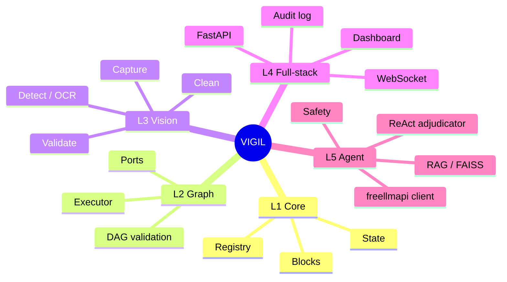
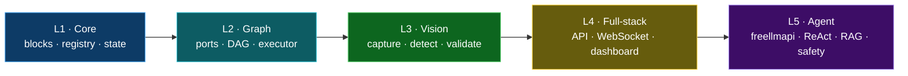
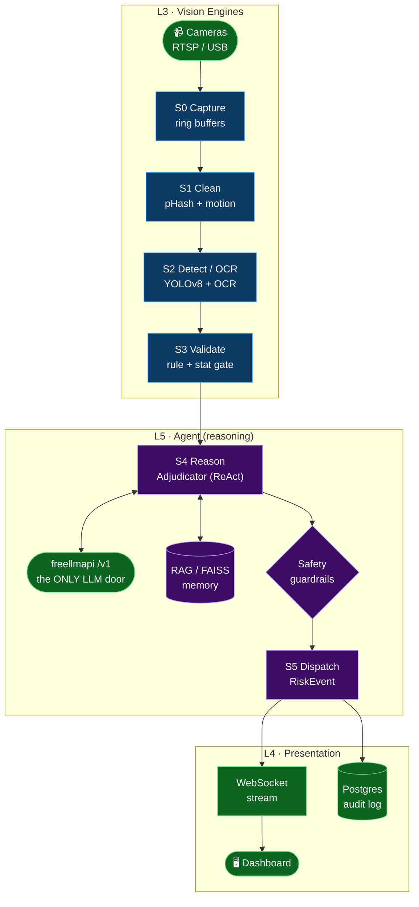
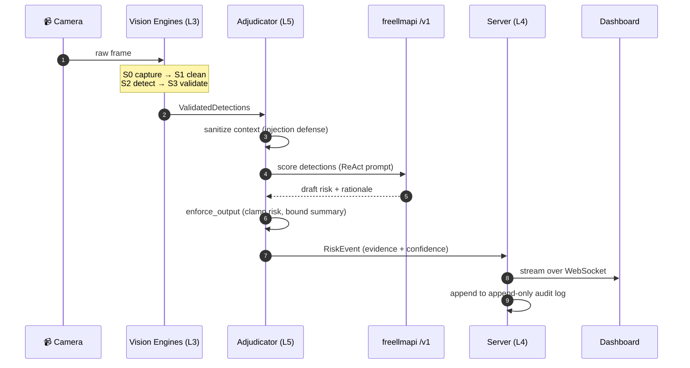
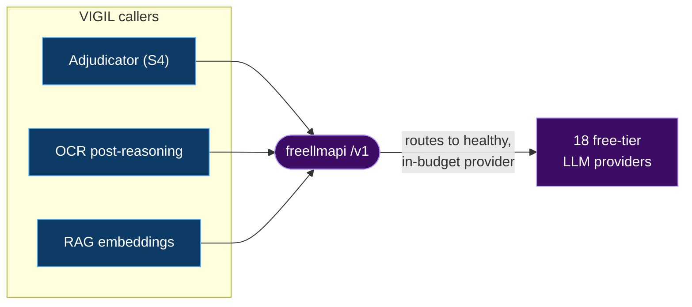

<div align="center">

# ⚡ VIGIL

### Visual Intelligence Graph &amp; Inference Layer

**A block-graph, real-time computer-vision platform with a single, swappable free-tier LLM reasoning core — [freellmapi](https://github.com/tashfeenahmed/freellmapi).**

_Turn any camera stream into risk-scored, human-readable, auditable events — through a pipeline of small, inspectable decisions instead of one opaque model._

<br/>

[](./LICENSE)
[](./pyproject.toml)
[](./server)
[](./.github/workflows/ci.yml)
[](https://github.com/tashfeenahmed/freellmapi)
[](#-project-status)
[-teal.svg)](#-the-five-layers-univision-learning-map)

</div>

---

## 📍 Table of Contents

- [What is VIGIL?](#-what-is-vigil)
- [Reference Lineage](#-reference-lineage-standing-on-four-shoulders)
- [The Five Layers](#-the-five-layers-univision-learning-map)
- [System Architecture](#-system-architecture)
- [The Pipeline (S0–S5)](#-the-pipeline-s0s5)
- [The AI Core — freellmapi only](#-the-ai-core--freellmapi-only)
- [Data Contracts](#-data-contracts)
- [Quickstart](#-quickstart)
- [Repository Layout](#-repository-layout)
- [Safety Model](#-safety-model-non-negotiable)
- [Evaluation Results](#-evaluation-results)
- [Project Status](#-project-status)
- [License & Attribution](#-license--attribution)

---

## 🧭 What is VIGIL?

VIGIL runs a live camera feed through a **validated block-graph** — `capture → clean → detect → validate → reason → report → store` — emitting a bounded, evidence-carrying `RiskEvent` at the end of every cycle.

The design philosophy is deliberate:

> **Not one big model. A pipeline of small, inspectable, swappable decisions.**

Each stage is a typed **Block** with declared input/output **ports**, wired into a **directed acyclic graph (DAG)** that is validated *before* it ever runs. The reasoning layer is intentionally centralized: **every LLM call in VIGIL goes to one place — the [freellmapi](https://github.com/tashfeenahmed/freellmapi) endpoint.** VIGIL never loads model weights, never runs a local model, and never hardcodes a provider. It speaks a single OpenAI-compatible `/v1` contract, and freellmapi handles routing, failover and provider selection behind that one door.



---

## 🧬 Reference Lineage: Standing on Four Shoulders

VIGIL is a **synthesis** — it borrows one hard-won idea from each of four production-grade open-source projects and fuses them into a single coherent stack. The concept cards below link to each upstream repository.

<table>
  <tr>
    <td width="50%" valign="top" align="center">
      <a href="https://github.com/roboflow/inference">
        
      </a>
      <br/><br/>
      <b>What VIGIL borrows:</b> the <i>Visual Workflow</i> editor, model-chaining <b>blocks</b>, and the live-video <code>InferencePipeline</code> abstraction — the idea that CV should be <i>composed, not coded</i>.
    </td>
    <td width="50%" valign="top" align="center">
      <a href="https://github.com/pysource-com/VisoNode">
        
      </a>
      <br/><br/>
      <b>What VIGIL borrows:</b> the <i>no-code node graph</i> UX — wire a <b>camera → YOLO → live output</b> visually, with zero boilerplate, so a graph is something you <i>draw</i>.
    </td>
  </tr>
  <tr>
    <td width="50%" valign="top" align="center">
      <a href="https://github.com/SharpAI/DeepCamera">
        
      </a>
      <br/><br/>
      <b>What VIGIL borrows:</b> <i>agentic camera reasoning</i> + edge alerting — the notion that a camera can <i>reason about a scene</i>, not just detect boxes. (In VIGIL that reasoning is delegated to freellmapi, never a local model.)
    </td>
    <td width="50%" valign="top" align="center">
      <a href="https://github.com/GetStream/Vision-Agents">
        
      </a>
      <br/><br/>
      <b>What VIGIL borrows:</b> the clean <b>detector ↔ reasoning-LLM split</b> inside a low-latency processor pipeline — <i>fast perception, slow deliberation</i>, cleanly separated.
    </td>
  </tr>
</table>

> ℹ️ **Attribution:** These upstream projects are independent works by their respective authors under their own licenses. VIGIL re-implements *concepts and interfaces* for learning purposes; it vendors none of their code, weights, or models.

---

## 📚 The Five Layers (UniVision Learning Map)

VIGIL is structured as five stacked layers. Each maps 1:1 to a directory and to a rung on the UniVision learning ladder — read the codebase bottom-up and you learn the whole stack.

| Layer | Domain | Responsibility | Lives in |
|:-----:|--------|----------------|----------|
| **L1** | Computational core | Variables, logic, state, block/registry primitives, pipelines | `core/` |
| **L2** | Visual programming | Blocks, ports, connections, DAG validation, execution order | `core/graph/` |
| **L3** | Computer vision | Frames, preprocessing, YOLO detection, OCR, tracking, anomaly | `engines/` |
| **L4** | Full-stack | FastAPI, WebSocket streaming, dashboard, queue, storage, metrics | `server/`, `frontend/` |
| **L5** | Agentic AI | freellmapi client, ReAct adjudication, RAG/FAISS, safety & human oversight | `agent/` |



---

## 🏗️ System Architecture



> The graph is **validated before execution**: every edge is a typed port contract, so a malformed pipeline fails at build time — never mid-stream on a live camera. Note there is exactly **one** LLM node in the entire graph: `freellmapi /v1`.

---

## 🔁 The Pipeline (S0–S5)

One pass over a single frame, end to end. Perception is fast and local; deliberation is a single remote call to freellmapi.



| Stage | Block | Guarantee |
|:-----:|-------|-----------|
| **S0** | `CaptureBlock` | Monotonic frame index; deterministic stub when no camera |
| **S1** | `CleanBlock` | Normalized geometry + color space for inference |
| **S2** | `DetectBlock` | Empty-but-valid output when no detector backend is present |
| **S3** | `ValidateBlock` | Drops low-confidence / malformed boxes; reports `dropped` count |
| **S4** | `Adjudicator` | Reasoning via **freellmapi only**; deterministic heuristic fallback when offline |
| **S5** | `Dispatch` | Bounded `RiskEvent` — `0.0 ≤ risk ≤ 1.0`, summary ≤ 280 chars |

---

## 🧠 The AI Core — freellmapi only

> 🔒 **Hard rule.** VIGIL has exactly **one** reasoning core: **[freellmapi](https://github.com/tashfeenahmed/freellmapi)**. There are **no local models**, **no bundled open-source weights**, and **no hardcoded provider names** anywhere in the codebase. Every chat, embedding, audio and image call flows through this single OpenAI-compatible `/v1` endpoint.



**Why a single door?**

- **Base URL:** `http://freellmapi:8080/v1` — one endpoint for chat, embeddings, audio and images.
- **Smart routing:** freellmapi picks the highest-priority *healthy, in-budget* provider; sticky sessions for 30 min.
- **Automatic failover:** transparent `429`/`5xx` fallback across the provider chain; embedding failover is locked to the same vector dimension so FAISS never breaks.
- **Zero coupling:** VIGIL code names no provider and loads no weights — swapping providers is a freellmapi config change, invisible to VIGIL.

```yaml
# config/llm.yaml (illustrative) — the ONLY place a model backend is referenced
base_url: http://freellmapi:8080/v1   # freellmapi is the sole LLM core
token: ${VIGIL_LLM_TOKEN}             # freellmapi-...
routing: priority-healthy-in-budget
sticky_session_minutes: 30
# note: no model name is hardcoded — freellmapi decides at call time
```

---

## 📦 Data Contracts

Every block speaks in typed dataclasses, so the graph is verifiable end to end. The two central contracts:

```python
@dataclass
class ValidatedDetections(Detections):   # Detections: frame_index + items
    frame_index: int              # monotonic, from S0
    items: list[Detection]        # each: label, confidence, bbox, track_id?, text?
    dropped: int = 0              # boxes removed at S3

@dataclass
class RiskEvent:
    frame_index: int              # provenance back to the source frame
    risk: float                   # clamped 0.0 .. 1.0
    label: str                    # e.g. "perimeter_breach" (defaulted if empty)
    summary: str                  # bounded, <= 280 chars
    detections: list[Detection] = field(default_factory=list)  # evidence boxes
    meta: dict = field(default_factory=dict)                    # provider, sanitized, etc.
```

> These are the exact contracts in [`engines/types.py`](./engines/types.py). `Detection` carries `label, confidence, bbox (x1,y1,x2,y2)` plus optional `track_id`/`text` (OCR).

---

## 🚀 Quickstart

### 0. Build the freellmapi swarm (one-time, outside this repo)

freellmapi is a separate service ([tashfeenahmed/freellmapi](https://github.com/tashfeenahmed/freellmapi)) that stacks free tiers from ~16 providers behind one endpoint, so VIGIL never sees or hardcodes a provider name. It ships as its own Docker image (`docker-compose.yml` below already wires it in) — you only need to feed it keys:

```bash
git clone https://github.com/tashfeenahmed/freellmapi.git && cd freellmapi
ENCRYPTION_KEY="$(openssl rand -hex 32)"; printf "ENCRYPTION_KEY=%s\nPORT=3001\n" "$ENCRYPTION_KEY" > .env
docker compose up -d
open http://localhost:3001   # Keys page: paste in provider keys, reorder the fallback chain
```

Free, quick-to-obtain keys worth stacking first (no credit card, a few minutes each):

| Provider | Where to get a key |
|---|---|
| Google Gemini | [aistudio.google.com](https://aistudio.google.com) |
| Groq | [console.groq.com](https://console.groq.com) |
| GitHub Models | uses your existing GitHub account — [github.com/marketplace/models](https://github.com/marketplace/models) |
| Cerebras | [cloud.cerebras.ai](https://cloud.cerebras.ai) |
| Mistral | [console.mistral.ai](https://console.mistral.ai) |
| OpenRouter | [openrouter.ai](https://openrouter.ai) (several models are free-tier) |
| HuggingFace | [huggingface.co/settings/tokens](https://huggingface.co/settings/tokens) |

freellmapi also supports NVIDIA, Cohere, Cloudflare, Z.ai, Ollama (local, no key), Kilo, Pollinations, LLM7, OVH AI Endpoints, OpenCode Zen, and AI Horde — check the freellmapi dashboard for the full, current list. More keys = more headroom before the router falls down the priority chain; that's the "quota-timeout-free" property in practice. Grab the unified key from the Keys page header and use it as `VIGIL_LLM_TOKEN` below.

### 1. Configure VIGIL

```bash
cp .env.example .env          # set VIGIL_LLM_TOKEN=freellmapi-...
```

### 2. Bring the stack up

```bash
docker compose up -d          # api :8000 · web :5173 · freellmapi :8080 · grafana :3000
python tools/validate.py      # validate every block + example DAG
open http://localhost:5173    # dashboard — drag blocks, wire a graph, hit Run
```

Run a workflow **headless**:

```bash
curl -X POST localhost:8000/v1/analyze \
  -H "Content-Type: application/json" \
  -d '{"workflow":"perimeter_safety","source":"rtsp://cam-1/stream"}'
```

Local development (no Docker):

```bash
python -m venv .venv && source .venv/bin/activate
pip install -e ".[dev]"
pytest -q                                          # run the test suite
uvicorn server.app:create_app --factory --reload    # serve the API
python tools/evaluate.py                            # score the pipeline on COCO128 (see below)
```

---

## 📂 Repository Layout

```text
vigil/
├─ core/        # L1 computational core: blocks, registry, state
│  └─ graph/    # L2 DAG wiring, port contracts, executor
├─ engines/     # L3 vision: capture · clean · detect · validate + shared types (stub-safe, no heavy deps)
├─ vision/      # L3 real backend: yolo_detector.py — YOLOv8 injected into DetectBlock via config['detector']
├─ agent/       # L5 freellmapi client · adjudicator · safety · rag · tools
├─ server/      # L4 FastAPI app · routes · schemas · WebSocket · metrics
├─ frontend/    # L4 dashboard: index.html · styles.css · app.js
├─ config/      # settings + pipeline.yaml (declarative S0–S3 DAG) + llm.yaml
├─ tools/       # validate.py (block + DAG validation) · evaluate.py (end-to-end scoring, see Evaluation Results)
├─ datasets/    # bundled COCO128 eval set (128 images + YOLO labels) so evaluate.py runs out of the box
├─ tests/       # pytest suites (test_engines, test_agent, test_vision, ...)
├─ .github/     # CI: pytest matrix + ruff lint
├─ ARCHITECTURE.md  CONTRIBUTING.md  docker-compose.yml  pyproject.toml  Makefile
└─ README.md
```

---

## 🛡️ Safety Model (Non-Negotiable)

The agent tool layer is treated as an **untrusted boundary in, bounded contract out**:

- **Evidence-first:** every AI event carries evidence, timestamp, source and confidence.
- **Human-in-the-loop:** high-stakes actions require explicit human approval.
- **Injection defense:** free text reaching the reasoning core passes through `agent.safety.sanitize_text`.
- **Output contract:** freellmapi output passes `enforce_output` — risk clamped to `[0,1]`, summary bounded, label defaulted.
- **Auditability:** an append-only audit log guards the tool layer.
- **Single trust surface:** because reasoning is centralized in freellmapi, there is exactly one outbound AI boundary to secure — no local model to sandbox, patch, or supply-chain audit.

---

## 📈 Evaluation Results

`tools/evaluate.py` runs the **real** pipeline end to end — S1 Clean → **S2 Detect (YOLOv8n, COCO-pretrained)** → S3 Validate → **S4 Adjudicate** — over [COCO128](https://github.com/ultralytics/assets/releases) (a 128-image, YOLO-labeled subset of COCO val2017; used here as a fast, standard, reproducible smoke-eval set, not a substitute for a full benchmark) and scores detection quality, latency, and risk-scoring behavior.

**Four real bugs were found and fixed while wiring this up** — all silent because nothing had exercised the real (non-stub, live-LLM) paths before:

1. `Adjudicator.decide()`'s no-provider fallback constructed `RiskEvent` without the required `frame_index`, so it raised `TypeError` instead of degrading gracefully — the exact failure mode the Safety Model section promises never happens. Fixed in `agent/adjudicator.py`; locked in by a new regression test.
2. Every block-construction test in `tests/test_engines.py` called `Block(config={...})`, but `Block.__init__` takes `**config` directly (matching how `core/graph/graph.py` actually instantiates blocks: `create(name, **node_config)`). The nested `config=` dict was silently swallowed. Two of the four affected tests only "passed" because their values happened to match the class defaults. Fixed to use the real kwargs contract.
3. The freellmapi client sent no `User-Agent`, so real gateways behind a WAF (e.g. Groq's edge) returned **HTTP 403** to the default `Python-urllib` agent and every live call silently degraded to the heuristic. Fixed by sending a `User-Agent` header (`agent/freellmapi_client.py`).
4. `_parse` called `json.loads()` directly on the model reply, but real chat models wrap JSON in prose or ```` ```json ```` fences even when told not to — so valid responses were discarded and fell back. Fixed with a tolerant `_extract_json` (direct parse → outermost `{…}` span) plus a stricter JSON-only prompt.

**Run 1 — full 128-image set, S4 on heuristic fallback** (no live `FREELLMAPI_BASE_URL` in this environment):

| Metric | All 80 COCO classes | Security-relevant subset¹ |
|---|:-:|:-:|
| Precision @ IoU 0.5 | 0.724 | 0.812 |
| Recall @ IoU 0.5 | 0.501 | 0.550 |
| F1 @ IoU 0.5 | 0.592 | 0.655 |
| TP / FP / FN | 465 / 177 / 464 | 211 / 49 / 173 |

¹ `person, bicycle, car, motorcycle, bus, truck, backpack, handbag, suitcase, knife, dog` — the classes VIGIL's perimeter/anomaly framing cares about.

| Stage | p50 latency | mean latency |
|---|:-:|:-:|
| S2 Detect (YOLOv8n, CPU) | 121.3 ms | 139.2 ms |
| S4 Adjudicate (heuristic) | 0.04 ms | 0.04 ms |

Risk score across all 128 frames: mean **0.734**, range **0.0–0.976** — monotonic in detection count/confidence as designed, since S4 had no live LLM to reason with in this run (`fallback_rate: 1.0`).

**Run 2 — live LLM reasoning at S4.** Set `FREELLMAPI_BASE_URL` / `FREELLMAPI_API_KEY` / `FREELLMAPI_MODEL` and re-ran `tools/evaluate.py` over a 30-image subset with a real free-tier provider reached through the OpenAI-compatible contract (`meta-llama` `llama-3.1-8b-instant`, served via the same `/v1/chat/completions` door freellmapi exposes). Every frame reasoned live — **`fallback_rate: 0.0`**, `reasoning_backend: freellmapi (live)`.

The detection metrics are unchanged by the LLM backend (same YOLOv8n over the images); what changes is S4. The headline comparison — **heuristic vs. live-LLM risk scoring** — is:

| S4 behavior | Run 1 · heuristic (128 img) | Run 2 · live LLM (30 img) |
|---|:-:|:-:|
| Reasoning backend | count/confidence heuristic | `llama-3.1-8b-instant` (live) |
| `fallback_rate` | 1.0 | **0.0** |
| S4 adjudicate latency (p50) | 0.04 ms | **518.6 ms** |
| Mean risk score | 0.734 | **0.367** |
| Risk range | 0.0 – 0.976 | 0.0 – 0.965 |

The live LLM assigns **markedly lower mean risk (0.37 vs 0.73)**: instead of treating any dense/confident frame as high-risk, it reasons about whether the detected objects are actually threatening — e.g. `person + knife → risk 0.85 "Potential Threat"`, but a lone `car` in a lot → near-zero. That semantic discrimination — at the cost of a real ~0.5 s network hop per frame — is the entire point of routing S4 through an LLM rather than a heuristic. Detection quality (perception) is untouched; only adjudication (deliberation) changes.

Raw output: [`eval_results.json`](./eval_results.json) (Run 1) and [`eval_results_live.json`](./eval_results_live.json) (Run 2) — both committed so the numbers are versioned alongside the code. The evaluation dataset itself (COCO128, 128 images + YOLO labels) is **bundled in [`datasets/coco128/`](./datasets/coco128)**, so `python tools/evaluate.py` reproduces the detection numbers with no download step.

---

## 📊 Project Status

> **Concept reference repository, with a real detection backend now wired in.** Interfaces, stubs and the five-layer architecture are complete and validated. `engines/blocks.py` still runs a deterministic stub path with zero heavy deps by default (so the graph stays importable and GPU-free); `vision/yolo_detector.py` (Phase 9) injects real YOLOv8 detection into that same `DetectBlock` contract with no changes to the block itself. Reasoning (S4) is real once `FREELLMAPI_BASE_URL` points at a running freellmapi instance with provider keys — see [Evaluation Results](#-evaluation-results) for how it behaves with and without one.

| Phase | Layer | State |
|:-----:|-------|:-----:|
| 1 | Skeleton | ✅ |
| 2 | L1 Core | ✅ |
| 3 | L3 Engines | ✅ |
| 4 | L5 Agent (freellmapi) | ✅ |
| 5 | L4 Server | ✅ |
| 6 | L4 Frontend | ✅ |
| 7 | Config / CI | ✅ |
| 8 | Tests | ✅ |
| 9 | Real detector backend (`vision/`) + evaluation harness (`tools/evaluate.py`) | ✅ |

---

## 📜 License & Attribution

VIGIL is released under the **[Apache-2.0](./LICENSE)** license. It is an educational synthesis inspired by — and crediting — four upstream projects: [roboflow/inference](https://github.com/roboflow/inference) · [pysource-com/VisoNode](https://github.com/pysource-com/VisoNode) · [SharpAI/DeepCamera](https://github.com/SharpAI/DeepCamera) · [GetStream/Vision-Agents](https://github.com/GetStream/Vision-Agents) — with **all reasoning powered exclusively by [tashfeenahmed/freellmapi](https://github.com/tashfeenahmed/freellmapi)**. All trademarks and code belong to their respective owners.

<div align="center">

**Built as a layered learning map · read it bottom-up (L1 → L5) and you learn the whole stack.**

</div>
